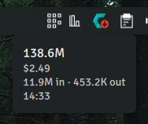
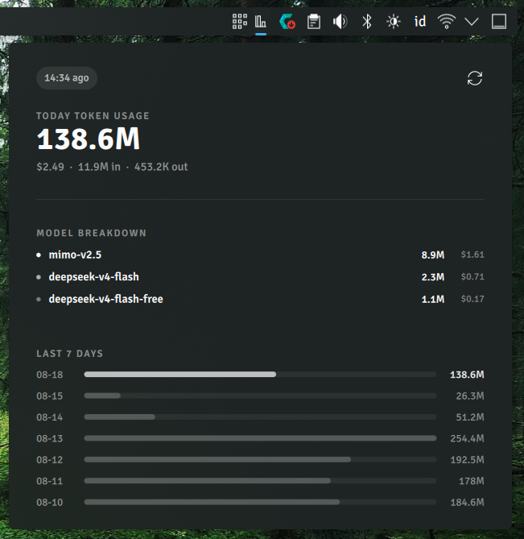
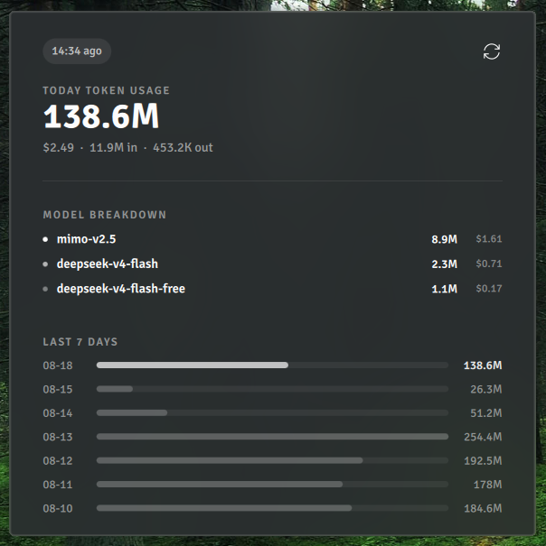

# Token Usage Monitor

KDE Plasma 6 system tray widget that displays AI coding agent token usage, powered by [ccusage](https://github.com/ccusage/ccusage).


## Features

- System tray icon with token count tooltip
- Popup with today's token usage, model breakdown, and 7-day history
- Configurable refresh interval and data file path
- Supports Claude Code, OpenCode, Codex, and 16+ AI agents via ccusage
- Auto-refresh every 5 minutes via systemd timer

## Screenshots

| Tray Icon | Popup Detail |
|-----------|-------------|
|  |  |

| Desktop |
|---------|
|  |

## Requirements

- KDE Plasma 6
- [ccusage](https://github.com/ccusage/ccusage) (installed automatically by setup script)
- Node.js runtime (for ccusage)

## Quick Setup

One command installs everything — ccusage, data timer, and Plasma XHR permissions:

```bash
git clone https://github.com/abuamar142/plasma-tokenusage.git
cd plasma-tokenusage
bash extras/setup.sh
```

Then add the widget: right-click panel → **Add Widgets** → search "Token Usage Monitor".

## Manual Install

### 1. Install Widget

```bash
git clone https://github.com/abuamar142/plasma-tokenusage.git
cd plasma-tokenusage

# System-wide install
plasma-plasmoidinstall package/

# Or symlink (development)
ln -sf "$(pwd)" ~/.local/share/plasma/plasmoids/com.github.abuamar.tokenusage
```

### 2. Run Setup Script

```bash
bash extras/setup.sh
```

This will:
- Install ccusage (if not present) via bun or npm
- Copy the wrapper script to `~/.local/bin/ccusage-wrapper`
- Enable a systemd timer that generates JSON data every 5 minutes
- Configure QML XHR file read permission for Plasma

### 3. Restart Plasma (if needed)

```bash
systemctl --user restart plasma-plasmashell
```

## Configuration

Right-click the tray icon → **Configure**. Options:

| Setting | Default | Description |
|---------|---------|-------------|
| Refresh interval | 30s | How often widget polls for new data (10-300s) |
| Data file path | `~/.cache/ccusage/tokenusage.json` | Path to ccusage JSON output |
| Show cost | on | Display cost in tooltip |
| Show breakdown | on | Show model breakdown in popup |

## How It Works

```
ccusage CLI → ~/.local/share/ccusage/*.jsonl (raw agent data)
    ↓ (every 5 min via systemd timer)
ccusage-wrapper → ~/.cache/ccusage/tokenusage.json (aggregated)
    ↓ (QML Timer polls file)
Widget → tray icon + popup display
```

## Supported AI Agents

Via ccusage, this widget tracks tokens from:

- Claude Code, Codex, OpenCode, Pi, Hermes Agent
- Droid, Codebuff, Goose, Kilo, Kimi, Qwen
- GitHub Copilot CLI, Gemini CLI, Grok Build
- And more... ([full list](https://github.com/ccusage/ccusage))

## Troubleshooting

### Widget shows "Unable to load data"

1. Check ccusage is installed: `which ccusage`
2. Check timer is running: `systemctl --user status ccusage-data.timer`
3. Check data file exists: `ls -la ~/.cache/ccusage/tokenusage.json`
4. Generate manually: `ccusage-wrapper`

### Widget icon not appearing

After install, restart Plasma: `systemctl --user restart plasma-plasmashell`

## License

GPL-2.0+ — see [LICENSE](LICENSE)
